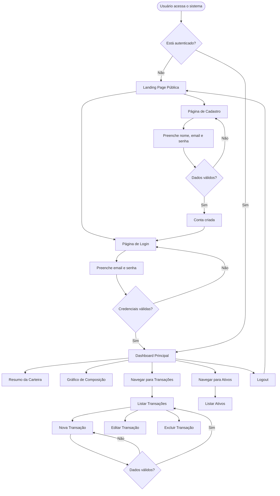
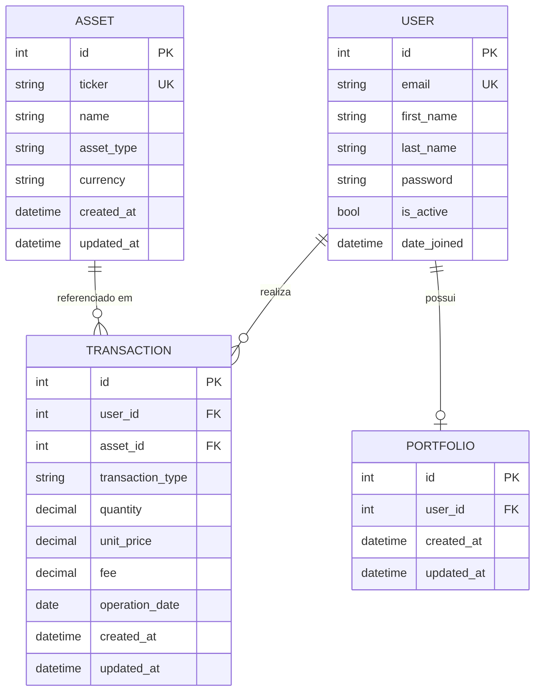

# PRD — Finanpy
> Sistema de Gestão de Investimentos em Renda Variável

---

## 1. Visão Geral

O **Finanpy** é uma aplicação web full stack desenvolvida com Python e Django para gestão pessoal de investimentos em renda variável. O sistema permite que investidores registrem, acompanhem e analisem suas operações de compra e venda de ativos financeiros como ações, FIIs, ETFs e stocks internacionais, tudo em uma interface moderna, responsiva e intuitiva.

---

## 2. Sobre o Produto

O Finanpy é uma plataforma web privada, com autenticação por email, que centraliza o controle de carteiras de investimentos. Cada usuário possui seu próprio ambiente isolado, com dashboard personalizado, histórico de transações e visão consolidada de seus ativos.

O produto é construído com Django full stack (Django Template Language + TailwindCSS), banco de dados SQLite, e é projetado para ser simples, enxuto e sem over engineering, com possibilidade de expansão futura para um app mobile via API REST.

---

## 3. Propósito

Oferecer ao investidor pessoa física uma ferramenta leve, gratuita e de fácil uso para:

- Registrar compras e vendas de ativos de renda variável
- Visualizar o desempenho e composição da carteira
- Ter controle histórico de todas as transações
- Tomar decisões mais embasadas sobre seus investimentos

---

## 4. Público-Alvo

- Investidores pessoa física brasileiros com interesse em renda variável
- Perfil: investidores individuais, de iniciantes a intermediários
- Faixa etária: 20 a 55 anos
- Usuários com acesso a computadores e smartphones

---

## 5. Objetivos

1. Permitir o cadastro e autenticação segura de usuários via email
2. Possibilitar o registro completo de transações de compra e venda de ativos
3. Exibir um dashboard com resumo consolidado da carteira
4. Apresentar o histórico de transações de forma clara e filtrável
5. Disponibilizar um site público de apresentação do produto
6. Garantir uma experiência de usuário moderna, responsiva e consistente

---

## 6. Requisitos Funcionais

### 6.1 Autenticação e Usuários

- RF01 — O sistema deve permitir cadastro de novos usuários com nome, email e senha
- RF02 — O login deve ser feito com email e senha (não username)
- RF03 — O sistema deve oferecer logout
- RF04 — O sistema deve redirecionar usuários não autenticados para a tela de login
- RF05 — Após login, o usuário deve ser redirecionado para o dashboard

### 6.2 Site Público

- RF06 — O sistema deve ter uma landing page pública com apresentação do produto
- RF07 — A landing page deve conter links para cadastro e login

### 6.3 Ativos (Assets)

- RF08 — O usuário deve poder visualizar a lista de ativos disponíveis
- RF09 — Deve existir um cadastro de ativos com: ticker, nome, tipo (Ação, FII, ETF, Stock) e moeda
- RF10 — Ativos devem ter created_at e updated_at

### 6.4 Transações (Transactions)

- RF11 — O usuário deve poder registrar uma transação de compra ou venda
- RF12 — Cada transação deve conter: ativo, tipo (compra/venda), quantidade, preço unitário, data da operação e taxa/corretagem (opcional)
- RF13 — O usuário deve poder listar, filtrar e visualizar o detalhe de suas transações
- RF14 — O usuário deve poder editar e excluir suas próprias transações
- RF15 — Transações devem ter created_at e updated_at

### 6.5 Portfólio (Portfolio)

- RF16 — O dashboard deve exibir um resumo da carteira do usuário
- RF17 — O resumo deve mostrar: total investido, ativos em carteira, quantidade por ativo e preço médio
- RF18 — O dashboard deve conter um gráfico de composição da carteira (por tipo de ativo)
- RF19 — O portfólio deve ser calculado dinamicamente com base nas transações

---

### 6.6 Flowchart de UX



---

## 7. Requisitos Não-Funcionais

- RNF01 — O sistema deve ser responsivo (mobile-first)
- RNF02 — O frontend deve ser implementado com Django Template Language + TailwindCSS
- RNF03 — O banco de dados deve ser SQLite nativo do Django
- RNF04 — Toda model deve possuir os campos `created_at` e `updated_at`
- RNF05 — O código deve seguir PEP8, usar aspas simples e ser escrito em inglês
- RNF06 — A interface do usuário deve ser em português brasileiro
- RNF07 — O sistema deve usar Class Based Views sempre que possível
- RNF08 — Signals devem ficar em arquivos `signals.py` dentro de cada app
- RNF09 — O design deve ser moderno, com fundo escuro, gradientes e paleta harmônica
- RNF10 — O sistema deve ser simples e enxuto, sem over engineering
- RNF11 — O sistema de autenticação nativo do Django deve ser utilizado
- RNF12 — Testes e Docker devem ser planejados para sprints finais

---

## 8. Arquitetura Técnica

### 8.1 Stack

| Camada | Tecnologia |
|---|---|
| Linguagem | Python 3.12+ |
| Framework Web | Django 5.x |
| Frontend | Django Template Language + TailwindCSS (CDN) |
| Banco de Dados | SQLite (nativo Django) |
| Autenticação | Django Auth (customizado para email) |
| Gráficos | Chart.js (via CDN) |
| Ambiente | Virtualenv / pip |

### 8.2 Estrutura de Dados



---

## 9. Design System

Todo o design é implementado com **TailwindCSS** (via CDN) dentro do **Django Template Language**. Um arquivo `base.html` define o layout base e o design system global.

### 9.1 Paleta de Cores

| Token | Classe Tailwind | Hex | Uso |
|---|---|---|---|
| Background principal | `bg-gray-950` | `#030712` | Fundo das páginas |
| Background card | `bg-gray-900` | `#111827` | Cards e painéis |
| Background input | `bg-gray-800` | `#1f2937` | Campos de formulário |
| Borda sutil | `border-gray-700` | `#374151` | Bordas de cards/inputs |
| Primária | `from-violet-600 to-indigo-600` | — | Gradiente principal |
| Destaque | `text-violet-400` | `#a78bfa` | Links, ícones ativos |
| Texto principal | `text-gray-100` | `#f3f4f6` | Textos primários |
| Texto secundário | `text-gray-400` | `#9ca3af` | Labels, textos auxiliares |
| Sucesso | `text-emerald-400` | `#34d399` | Valores positivos, compras |
| Perigo | `text-red-400` | `#f87171` | Valores negativos, vendas |
| Aviso | `text-yellow-400` | `#facc15` | Alertas |

### 9.2 Tipografia

```html
<!-- Fonte: Inter via Google Fonts (importada no base.html) -->
<link href="https://fonts.googleapis.com/css2?family=Inter:wght@300;400;500;600;700&display=swap" rel="stylesheet">

<!-- Aplicada no body -->
<body class="font-['Inter'] bg-gray-950 text-gray-100 antialiased">

<!-- Títulos de página -->
<h1 class="text-3xl font-bold text-gray-100">Título</h1>

<!-- Subtítulos -->
<h2 class="text-xl font-semibold text-gray-200">Subtítulo</h2>

<!-- Labels de seção -->
<h3 class="text-sm font-medium text-gray-400 uppercase tracking-wider">Label</h3>

<!-- Texto corrido -->
<p class="text-sm text-gray-300 leading-relaxed">Texto</p>
```

### 9.3 Botões

```html
<!-- Botão primário (gradiente) -->
<button class="w-full bg-gradient-to-r from-violet-600 to-indigo-600 hover:from-violet-500 hover:to-indigo-500
               text-white font-semibold py-2.5 px-6 rounded-lg transition-all duration-200
               focus:outline-none focus:ring-2 focus:ring-violet-500 focus:ring-offset-2 focus:ring-offset-gray-900">
  Confirmar
</button>

<!-- Botão secundário (outline) -->
<button class="border border-gray-600 hover:border-gray-500 text-gray-300 hover:text-gray-100
               font-medium py-2.5 px-6 rounded-lg transition-all duration-200
               focus:outline-none focus:ring-2 focus:ring-gray-500">
  Cancelar
</button>

<!-- Botão de perigo -->
<button class="bg-red-600/20 hover:bg-red-600/30 border border-red-600/50 text-red-400
               font-medium py-2 px-4 rounded-lg transition-all duration-200">
  Excluir
</button>

<!-- Botão pequeno/ação -->
<button class="text-violet-400 hover:text-violet-300 text-sm font-medium transition-colors duration-200">
  Editar
</button>
```

### 9.4 Inputs e Formulários

```html
<!-- Label -->
<label class="block text-sm font-medium text-gray-300 mb-1.5">Campo</label>

<!-- Input padrão -->
<input type="text"
       class="w-full bg-gray-800 border border-gray-700 rounded-lg px-4 py-2.5
              text-gray-100 placeholder-gray-500 text-sm
              focus:outline-none focus:ring-2 focus:ring-violet-500 focus:border-transparent
              transition-all duration-200">

<!-- Select -->
<select class="w-full bg-gray-800 border border-gray-700 rounded-lg px-4 py-2.5
               text-gray-100 text-sm
               focus:outline-none focus:ring-2 focus:ring-violet-500 focus:border-transparent">
  <option>Opção</option>
</select>

<!-- Mensagem de erro -->
<p class="mt-1 text-xs text-red-400">Mensagem de erro</p>

<!-- Card de formulário -->
<div class="bg-gray-900 border border-gray-800 rounded-xl p-6 shadow-xl">
  <!-- campos -->
</div>
```

### 9.5 Cards e Painéis

```html
<!-- Card de métrica -->
<div class="bg-gray-900 border border-gray-800 rounded-xl p-5 shadow-lg hover:border-gray-700 transition-colors">
  <p class="text-xs font-medium text-gray-400 uppercase tracking-wider mb-1">Total Investido</p>
  <p class="text-2xl font-bold text-gray-100">R$ 12.500,00</p>
  <p class="text-xs text-emerald-400 mt-1">+5,2% este mês</p>
</div>

<!-- Card de lista -->
<div class="bg-gray-900 border border-gray-800 rounded-xl overflow-hidden shadow-lg">
  <div class="px-6 py-4 border-b border-gray-800">
    <h2 class="text-base font-semibold text-gray-100">Título do Card</h2>
  </div>
  <div class="p-6">
    <!-- conteúdo -->
  </div>
</div>
```

### 9.6 Tabelas

```html
<div class="bg-gray-900 border border-gray-800 rounded-xl overflow-hidden">
  <table class="w-full text-sm">
    <thead>
      <tr class="border-b border-gray-800">
        <th class="px-6 py-3 text-left text-xs font-medium text-gray-400 uppercase tracking-wider">Coluna</th>
      </tr>
    </thead>
    <tbody class="divide-y divide-gray-800">
      <tr class="hover:bg-gray-800/50 transition-colors">
        <td class="px-6 py-4 text-gray-300">Dado</td>
      </tr>
    </tbody>
  </table>
</div>
```

### 9.7 Menu / Navbar

```html
<!-- Sidebar de navegação (desktop) -->
<aside class="w-64 bg-gray-900 border-r border-gray-800 min-h-screen flex flex-col">
  <!-- Logo -->
  <div class="px-6 py-5 border-b border-gray-800">
    <span class="text-xl font-bold bg-gradient-to-r from-violet-400 to-indigo-400 bg-clip-text text-transparent">
      Finanpy
    </span>
  </div>
  <!-- Links de navegação -->
  <nav class="flex-1 px-4 py-4 space-y-1">
    <a href="#" class="flex items-center gap-3 px-3 py-2.5 rounded-lg text-sm font-medium
                       text-gray-300 hover:text-gray-100 hover:bg-gray-800 transition-all duration-200">
      Dashboard
    </a>
    <!-- link ativo -->
    <a href="#" class="flex items-center gap-3 px-3 py-2.5 rounded-lg text-sm font-medium
                       text-violet-400 bg-violet-500/10 border border-violet-500/20">
      Transações
    </a>
  </nav>
</aside>
```

### 9.8 Grid e Layout

```html
<!-- Layout base com sidebar -->
<div class="flex min-h-screen bg-gray-950">
  <!-- sidebar -->
  <aside class="w-64 ..."></aside>
  <!-- conteúdo principal -->
  <main class="flex-1 overflow-auto">
    <div class="max-w-7xl mx-auto px-6 py-8">
      <!-- Grid de cards métricas -->
      <div class="grid grid-cols-1 sm:grid-cols-2 lg:grid-cols-4 gap-4 mb-8">
        <!-- cards -->
      </div>
      <!-- Grid de conteúdo 2 colunas -->
      <div class="grid grid-cols-1 lg:grid-cols-3 gap-6">
        <!-- coluna larga -->
        <div class="lg:col-span-2">...</div>
        <!-- coluna estreita -->
        <div class="lg:col-span-1">...</div>
      </div>
    </div>
  </main>
</div>
```

---

## 10. User Stories

### Épico 1 — Autenticação e Onboarding

**US01 — Cadastro de usuário**
> Como visitante, quero me cadastrar com meu nome, email e senha para ter acesso ao sistema.

Critérios de aceite:
- [ ] O formulário de cadastro deve ter os campos: nome, email, senha e confirmação de senha
- [ ] O email deve ser único no sistema
- [ ] A senha deve ter no mínimo 8 caracteres
- [ ] Após cadastro bem-sucedido, o usuário deve ser redirecionado para a tela de login
- [ ] Mensagens de erro devem ser exibidas inline nos campos com problema

**US02 — Login por email**
> Como usuário cadastrado, quero fazer login com meu email e senha.

Critérios de aceite:
- [ ] O formulário de login deve ter os campos email e senha
- [ ] Credenciais inválidas devem exibir mensagem de erro
- [ ] Após login bem-sucedido, redirecionar para o dashboard
- [ ] Usuários não autenticados que acessam páginas protegidas devem ser redirecionados para o login

**US03 — Logout**
> Como usuário autenticado, quero fazer logout do sistema.

Critérios de aceite:
- [ ] O menu deve conter opção de logout
- [ ] Após logout, redirecionar para a landing page

---

### Épico 2 — Ativos Financeiros

**US04 — Visualizar ativos**
> Como usuário, quero visualizar a lista de ativos cadastrados no sistema.

Critérios de aceite:
- [ ] Exibir lista com ticker, nome, tipo e moeda
- [ ] A lista deve ser paginada ou apresentada em tabela com scroll

**US05 — Cadastrar ativo**
> Como usuário, quero cadastrar um ativo para poder usá-lo em minhas transações.

Critérios de aceite:
- [ ] O formulário deve ter ticker, nome, tipo (Ação/FII/ETF/Stock) e moeda (BRL/USD)
- [ ] O ticker deve ser único
- [ ] Exibir mensagem de sucesso ao salvar

---

### Épico 3 — Transações

**US06 — Registrar transação de compra**
> Como usuário, quero registrar uma compra de ativo para manter o histórico da minha carteira.

Critérios de aceite:
- [ ] O formulário deve ter: ativo, tipo (Compra), quantidade, preço unitário, data e taxa (opcional)
- [ ] Todos os campos obrigatórios devem ser validados
- [ ] Após salvar, redirecionar para a lista de transações com mensagem de sucesso

**US07 — Registrar transação de venda**
> Como usuário, quero registrar uma venda de ativo.

Critérios de aceite:
- [ ] O formulário deve ter: ativo, tipo (Venda), quantidade, preço unitário, data e taxa (opcional)
- [ ] Não deve ser possível vender quantidade superior ao saldo em carteira
- [ ] Após salvar, exibir mensagem de sucesso

**US08 — Listar transações**
> Como usuário, quero ver todas as minhas transações em ordem cronológica.

Critérios de aceite:
- [ ] Exibir: data, ativo, tipo, quantidade, preço e valor total
- [ ] Transações de compra e venda devem ter cores distintas (verde/vermelho)
- [ ] Deve ser possível filtrar por ativo e por tipo

**US09 — Editar transação**
> Como usuário, quero corrigir os dados de uma transação registrada incorretamente.

Critérios de aceite:
- [ ] O formulário de edição deve ser pré-preenchido com os dados atuais
- [ ] Após salvar, redirecionar para a lista com mensagem de sucesso

**US10 — Excluir transação**
> Como usuário, quero excluir uma transação inválida da minha lista.

Critérios de aceite:
- [ ] Deve existir confirmação antes da exclusão
- [ ] Após excluir, redirecionar para a lista com mensagem de sucesso

---

### Épico 4 — Dashboard e Portfólio

**US11 — Visualizar resumo da carteira**
> Como usuário, quero ver um resumo consolidado dos meus investimentos no dashboard.

Critérios de aceite:
- [ ] Exibir: total investido, número de ativos em carteira, maior posição e data da última transação
- [ ] Os valores devem ser calculados com base nas transações do usuário

**US12 — Ver gráfico de composição**
> Como usuário, quero visualizar um gráfico da composição da minha carteira por tipo de ativo.

Critérios de aceite:
- [ ] Exibir gráfico de pizza/donut com percentual por tipo (Ação, FII, ETF, Stock)
- [ ] O gráfico deve usar Chart.js

---

## 11. Métricas de Sucesso

### KPIs de Produto

| Métrica | Descrição | Meta inicial |
|---|---|---|
| Uptime | Disponibilidade do sistema | >= 99% |
| Tempo de carregamento | Tempo de resposta das páginas principais | < 2s |
| Erros 500 | Taxa de erros internos | < 0,1% das requisições |

### KPIs de Usuário

| Métrica | Descrição | Meta inicial |
|---|---|---|
| Cadastros | Novos usuários por mês | Baseline no 1º mês |
| Retenção | Usuários que retornam após 7 dias | >= 40% |
| Transações registradas | Média de transações por usuário ativo | >= 5/mês |
| DAU/MAU | Proporção de usuários diários/mensais | >= 20% |

---

## 12. Riscos e Mitigações

| Risco | Probabilidade | Impacto | Mitigação |
|---|---|---|---|
| Cálculo incorreto de preço médio | Média | Alto | Testes unitários na lógica de cálculo (sprint final) |
| Perda de dados por falta de backup | Baixa | Alto | Documentar rotina de backup do SQLite |
| Escalabilidade do SQLite | Baixa | Médio | Estrutura preparada para migração ao PostgreSQL |
| Autenticação vulnerável | Baixa | Alto | Usar apenas sistema nativo do Django, manter dependências atualizadas |
| Layout quebrando em mobile | Média | Médio | Testar responsividade com Tailwind em múltiplos breakpoints |
| Complexidade de escopo crescente | Alta | Médio | Manter documentação do PRD e não adicionar features não planejadas |

---

## 13. Lista de Tarefas por Sprint

---

### Sprint 0 — Configuração do Projeto

#### Tarefa 0.1 — Ambiente e dependências
- [X] 0.1.1 Criar e ativar o ambiente virtual Python (`python -m venv .venv`)
- [X] 0.1.2 Instalar Django (`pip install django`)
- [X] 0.1.3 Criar arquivo `requirements.txt` com as dependências iniciais
- [ ] 0.1.4 Verificar a estrutura de diretórios do projeto conforme a arquitetura definida

#### Tarefa 0.2 — Configurações do Django (`core/settings.py`)
- [X] 0.2.1 Configurar `INSTALLED_APPS` com as apps: `assets`, `portfolios`, `transactions`
- [ ] 0.2.2 Configurar `LANGUAGE_CODE = 'pt-br'` e `TIME_ZONE = 'America/Sao_Paulo'`
- [ ] 0.2.3 Configurar `DATABASES` para SQLite
- [ ] 0.2.4 Configurar `STATIC_URL` e `STATICFILES_DIRS`
- [ ] 0.2.5 Configurar `TEMPLATES` com `DIRS` apontando para a pasta `templates/`
- [ ] 0.2.6 Configurar `LOGIN_URL`, `LOGIN_REDIRECT_URL` e `LOGOUT_REDIRECT_URL`
- [ ] 0.2.7 Definir `AUTH_USER_MODEL` para o modelo customizado de usuário

#### Tarefa 0.3 — Usuário customizado (login por email)
- [ ] 0.3.1 Criar app `accounts` com `python manage.py startapp accounts`
- [ ] 0.3.2 Criar model `CustomUser` extendendo `AbstractUser` dentro de `accounts/models.py`
- [ ] 0.3.3 Sobrescrever campo `USERNAME_FIELD = 'email'` e `REQUIRED_FIELDS = ['first_name', 'last_name']`
- [ ] 0.3.4 Definir campo `email` como `unique=True`
- [ ] 0.3.5 Criar `CustomUserManager` estendendo `BaseUserManager` com métodos `create_user` e `create_superuser`
- [ ] 0.3.6 Registrar `AUTH_USER_MODEL = 'accounts.CustomUser'` no `settings.py`
- [ ] 0.3.7 Criar e executar as migrações iniciais (`makemigrations` + `migrate`)

#### Tarefa 0.4 — URLs principais
- [ ] 0.4.1 Configurar `core/urls.py` com include para as apps: `accounts`, `assets`, `transactions`, `portfolios`
- [ ] 0.4.2 Adicionar rota para a landing page pública na raiz `/`

---

### Sprint 1 — Design System e Templates Base

#### Tarefa 1.1 — Estrutura de templates
- [ ] 1.1.1 Criar pasta `templates/` na raiz do projeto
- [ ] 1.1.2 Criar subpastas: `templates/accounts/`, `templates/assets/`, `templates/transactions/`, `templates/portfolios/`, `templates/public/`
- [ ] 1.1.3 Criar arquivo `templates/base.html` com o layout base do sistema autenticado
- [ ] 1.1.4 Criar arquivo `templates/public/base_public.html` com layout base para páginas públicas

#### Tarefa 1.2 — Implementar `base.html` (área autenticada)
- [ ] 1.2.1 Adicionar `<head>` com meta tags, title block, importação do TailwindCSS via CDN e fonte Inter
- [ ] 1.2.2 Implementar sidebar de navegação com logo Finanpy (gradiente violeta/índigo)
- [ ] 1.2.3 Adicionar links de navegação na sidebar: Dashboard, Transações, Ativos
- [ ] 1.2.4 Implementar estado ativo no link de navegação usando `request.resolver_match.url_name`
- [ ] 1.2.5 Adicionar informações do usuário e botão de logout no rodapé da sidebar
- [ ] 1.2.6 Implementar área `main` com ``
- [ ] 1.2.7 Adicionar área de mensagens (Django messages framework) com estilos de sucesso/erro/aviso
- [ ] 1.2.8 Garantir que o layout seja responsivo com menu hamburguer para mobile (TailwindCSS)

#### Tarefa 1.3 — Implementar `base_public.html`
- [ ] 1.3.1 Criar header com logo e links de Cadastro e Login
- [ ] 1.3.2 Implementar fundo escuro com gradiente sutil
- [ ] 1.3.3 Adicionar footer simples com nome do produto

#### Tarefa 1.4 — Componentes reutilizáveis (includes)
- [ ] 1.4.1 Criar `templates/components/card_metric.html` para cards de métricas do dashboard
- [ ] 1.4.2 Criar `templates/components/table.html` como estrutura base de tabelas
- [ ] 1.4.3 Criar `templates/components/form_field.html` para renderização padronizada de campos de formulário
- [ ] 1.4.4 Criar `templates/components/badge.html` para badges de tipo (Compra/Venda, tipo de ativo)
- [ ] 1.4.5 Criar `templates/components/empty_state.html` para estado de lista vazia

---

### Sprint 2 — Site Público e Autenticação

#### Tarefa 2.1 — Landing Page
- [ ] 2.1.1 Criar view `LandingPageView` (TemplateView) em `accounts/views.py` ou em uma view standalone
- [ ] 2.1.2 Criar template `templates/public/landing.html` extendendo `base_public.html`
- [ ] 2.1.3 Implementar seção hero com título, subtítulo e botões de Cadastro e Login
- [ ] 2.1.4 Implementar seção de features resumidas do produto
- [ ] 2.1.5 Configurar URL `/` apontando para `LandingPageView`
- [ ] 2.1.6 Redirecionar usuário já autenticado para o dashboard ao acessar a landing page

#### Tarefa 2.2 — Formulário de Cadastro
- [ ] 2.2.1 Criar `CustomUserCreationForm` em `accounts/forms.py` com campos: `first_name`, `last_name`, `email`, `password1`, `password2`
- [ ] 2.2.2 Adicionar validação de email único no `clean_email()`
- [ ] 2.2.3 Criar `RegisterView` (FormView ou CreateView) em `accounts/views.py`
- [ ] 2.2.4 Criar template `templates/accounts/register.html` com o formulário de cadastro estilizado
- [ ] 2.2.5 Após cadastro, redirecionar para a tela de login com mensagem de sucesso
- [ ] 2.2.6 Configurar URL `/cadastro/` para `RegisterView`

#### Tarefa 2.3 — Formulário de Login
- [ ] 2.3.1 Criar `EmailAuthenticationForm` em `accounts/forms.py` extendendo `AuthenticationForm` para usar email
- [ ] 2.3.2 Criar `CustomLoginView` extendendo `LoginView` do Django com `form_class = EmailAuthenticationForm`
- [ ] 2.3.3 Criar template `templates/accounts/login.html` com formulário de login estilizado
- [ ] 2.3.4 Configurar URL `/login/` para `CustomLoginView`

#### Tarefa 2.4 — Logout
- [ ] 2.4.1 Usar a `LogoutView` nativa do Django
- [ ] 2.4.2 Configurar URL `/logout/` e `LOGOUT_REDIRECT_URL = '/'` no settings
- [ ] 2.4.3 Adicionar link de logout na sidebar do `base.html`

---

### Sprint 3 — App de Ativos (Assets)

#### Tarefa 3.1 — Model `Asset`
- [ ] 3.1.1 Criar model `Asset` em `assets/models.py` com campos: `ticker` (CharField, unique), `name` (CharField), `asset_type` (CharField com choices: STOCK, FII, ETF, INTERNATIONAL), `currency` (CharField com choices: BRL, USD)
- [ ] 3.1.2 Adicionar campos `created_at` (auto_now_add) e `updated_at` (auto_now)
- [ ] 3.1.3 Implementar método `__str__` retornando `f'{self.ticker} - {self.name}'`
- [ ] 3.1.4 Criar e executar a migração do model Asset

#### Tarefa 3.2 — Admin do Asset
- [ ] 3.2.1 Registrar `Asset` no `assets/admin.py` com `list_display`, `search_fields` e `list_filter`

#### Tarefa 3.3 — Form de Asset
- [ ] 3.3.1 Criar `AssetForm` em `assets/forms.py` usando `ModelForm`
- [ ] 3.3.2 Estilizar os widgets do form com as classes Tailwind do design system

#### Tarefa 3.4 — Views de Asset
- [ ] 3.4.1 Criar `AssetListView` (ListView) em `assets/views.py` com `LoginRequiredMixin`
- [ ] 3.4.2 Criar `AssetCreateView` (CreateView) com `LoginRequiredMixin`
- [ ] 3.4.3 Configurar `success_url` com `reverse_lazy('assets:list')`
- [ ] 3.4.4 Adicionar mensagem de sucesso ao criar ativo

#### Tarefa 3.5 — Templates de Asset
- [ ] 3.5.1 Criar `templates/assets/asset_list.html` com tabela de ativos e botão de novo ativo
- [ ] 3.5.2 Criar `templates/assets/asset_form.html` com formulário de criação de ativo
- [ ] 3.5.3 Tratar estado de lista vazia usando o componente `empty_state.html`

#### Tarefa 3.6 — URLs de Asset
- [ ] 3.6.1 Criar `assets/urls.py` com rotas: `list` (`/ativos/`) e `create` (`/ativos/novo/`)
- [ ] 3.6.2 Incluir `assets/urls.py` no `core/urls.py` com namespace `assets`

---

### Sprint 4 — App de Transações (Transactions)

#### Tarefa 4.1 — Model `Transaction`
- [ ] 4.1.1 Criar model `Transaction` em `transactions/models.py` com campos: `user` (FK para `settings.AUTH_USER_MODEL`), `asset` (FK para `Asset`), `transaction_type` (CharField choices: BUY, SELL), `quantity` (DecimalField), `unit_price` (DecimalField), `fee` (DecimalField, default=0), `operation_date` (DateField)
- [ ] 4.1.2 Adicionar campos `created_at` e `updated_at`
- [ ] 4.1.3 Implementar `__str__` retornando tipo, ticker e data
- [ ] 4.1.4 Criar propriedade `total_value` calculando `quantity * unit_price + fee`
- [ ] 4.1.5 Criar e executar migração do model Transaction

#### Tarefa 4.2 — Admin de Transaction
- [ ] 4.2.1 Registrar `Transaction` no `transactions/admin.py` com `list_display`, `list_filter` e `search_fields`

#### Tarefa 4.3 — Form de Transaction
- [ ] 4.3.1 Criar `TransactionForm` em `transactions/forms.py` usando `ModelForm`
- [ ] 4.3.2 Excluir o campo `user` do formulário (será preenchido na view)
- [ ] 4.3.3 Adicionar widget `DateInput` com `type='date'` para `operation_date`
- [ ] 4.3.4 Estilizar todos os widgets com as classes Tailwind do design system

#### Tarefa 4.4 — Views de Transaction
- [ ] 4.4.1 Criar `TransactionListView` (ListView) com `LoginRequiredMixin`, filtrando apenas transações do usuário logado
- [ ] 4.4.2 Criar `TransactionCreateView` (CreateView) com `LoginRequiredMixin`
- [ ] 4.4.3 Sobrescrever `form_valid` para associar `form.instance.user = self.request.user`
- [ ] 4.4.4 Criar `TransactionUpdateView` (UpdateView) com `LoginRequiredMixin`
- [ ] 4.4.5 Sobrescrever `get_queryset` para garantir que o usuário só edite suas próprias transações
- [ ] 4.4.6 Criar `TransactionDeleteView` (DeleteView) com `LoginRequiredMixin` e mesmo filtro de queryset
- [ ] 4.4.7 Adicionar mensagens de sucesso em create, update e delete

#### Tarefa 4.5 — Templates de Transaction
- [ ] 4.5.1 Criar `templates/transactions/transaction_list.html` com tabela de transações e badges coloridos por tipo
- [ ] 4.5.2 Criar `templates/transactions/transaction_form.html` para criação e edição
- [ ] 4.5.3 Criar `templates/transactions/transaction_confirm_delete.html` com modal/página de confirmação
- [ ] 4.5.4 Implementar filtro por ativo e tipo usando GET params no `TransactionListView`
- [ ] 4.5.5 Tratar estado vazio com componente `empty_state.html`

#### Tarefa 4.6 — URLs de Transaction
- [ ] 4.6.1 Criar `transactions/urls.py` com rotas: `list`, `create`, `update/<pk>/`, `delete/<pk>/`
- [ ] 4.6.2 Incluir no `core/urls.py` com namespace `transactions`

---

### Sprint 5 — Dashboard e Portfólio

#### Tarefa 5.1 — Lógica de portfólio
- [ ] 5.1.1 Criar arquivo `portfolios/services.py` com função `get_portfolio_summary(user)` que retorna dados consolidados da carteira
- [ ] 5.1.2 A função deve calcular: total investido (soma de compras - soma de vendas), lista de ativos com saldo positivo, quantidade e preço médio ponderado por ativo
- [ ] 5.1.3 Criar função `get_composition_by_type(user)` retornando o percentual investido por tipo de ativo

#### Tarefa 5.2 — View do Dashboard
- [ ] 5.2.1 Criar `DashboardView` (TemplateView ou View) em `portfolios/views.py` com `LoginRequiredMixin`
- [ ] 5.2.2 No `get_context_data`, chamar `get_portfolio_summary` e `get_composition_by_type` e passar os resultados para o template
- [ ] 5.2.3 Passar os dados do gráfico como JSON serializado para o template

#### Tarefa 5.3 — Template do Dashboard
- [ ] 5.3.1 Criar `templates/portfolios/dashboard.html` extendendo `base.html`
- [ ] 5.3.2 Implementar grid de 4 cards de métricas (total investido, nº de ativos, maior posição, última transação)
- [ ] 5.3.3 Implementar gráfico de composição por tipo usando Chart.js (doughnut chart)
- [ ] 5.3.4 Implementar tabela resumida das posições em carteira (ativo, quantidade, preço médio, valor atual estimado)
- [ ] 5.3.5 Exibir estado vazio quando não há transações cadastradas

#### Tarefa 5.4 — URLs do Dashboard
- [ ] 5.4.1 Criar `portfolios/urls.py` com rota `/dashboard/` para `DashboardView`
- [ ] 5.4.2 Incluir no `core/urls.py` com namespace `portfolios`
- [ ] 5.4.3 Configurar `LOGIN_REDIRECT_URL = '/dashboard/'` no `settings.py`

---

### Sprint 6 — Ajustes Finais e Polimento

#### Tarefa 6.1 — Página 404 customizada
- [ ] 6.1.1 Criar template `templates/404.html` com layout do design system
- [ ] 6.1.2 Configurar handler404 no `core/urls.py`

#### Tarefa 6.2 — Mensagens globais
- [ ] 6.2.1 Revisar todos os formulários e garantir que mensagens de sucesso e erro estão sendo exibidas corretamente via Django messages framework
- [ ] 6.2.2 Garantir que as mensagens somem após a exibição (auto-dismiss com JS simples ou via Tailwind)

#### Tarefa 6.3 — Segurança básica
- [ ] 6.3.1 Verificar que todas as views autenticadas possuem `LoginRequiredMixin`
- [ ] 6.3.2 Verificar que querysets de transações sempre filtram por `user=request.user`
- [ ] 6.3.3 Garantir que o token CSRF está presente em todos os formulários ``

#### Tarefa 6.4 — Revisão de responsividade
- [ ] 6.4.1 Testar todas as telas em viewport mobile (375px)
- [ ] 6.4.2 Testar em viewport tablet (768px)
- [ ] 6.4.3 Testar em viewport desktop (1280px+)
- [ ] 6.4.4 Corrigir problemas de layout identificados

#### Tarefa 6.5 — Dados iniciais
- [ ] 6.5.1 Criar arquivo `assets/fixtures/initial_assets.json` com alguns ativos populares pré-cadastrados (ex: PETR4, MXRF11, BOVA11, IVVB11)
- [ ] 6.5.2 Documentar no README como carregar os fixtures: `python manage.py loaddata initial_assets`

#### Tarefa 6.6 — README do projeto
- [ ] 6.6.1 Criar `README.md` com: descrição do projeto, pré-requisitos, instruções de instalação e execução, estrutura de diretórios e como carregar fixtures

---

### Sprint 7 (Final) — Testes e Docker *(planejado)*

#### Tarefa 7.1 — Testes unitários
- [ ] 7.1.1 Configurar ambiente de testes
- [ ] 7.1.2 Escrever testes para a lógica de cálculo de portfólio (`portfolios/services.py`)
- [ ] 7.1.3 Escrever testes para models (validações e propriedades calculadas)
- [ ] 7.1.4 Escrever testes de integração para as views principais

#### Tarefa 7.2 — Docker
- [ ] 7.2.1 Criar `Dockerfile` para a aplicação Django
- [ ] 7.2.2 Criar `docker-compose.yml` com serviço web
- [ ] 7.2.3 Testar build e execução via Docker
- [ ] 7.2.4 Atualizar README com instruções de execução via Docker

---

*PRD gerado em: Fevereiro/2026 — Versão 1.0*
